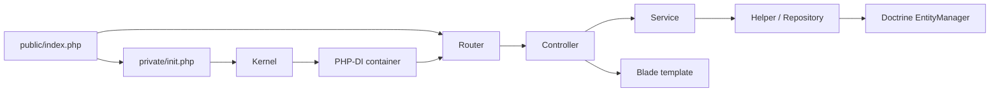

# Architecture

This guide describes the current Journal application structure.

## Request flow

1. `private/init.php` loads Composer and dotenv, validates required environment values, defines path/runtime constants, starts the PHP session, installs security headers, optionally initializes Sentry, and creates the Kernel.
2. `App\Framework\Kernel` creates the PHP-DI container through `ContainerFactory`.
3. `ContainerFactory` enables autowiring, loads `config/services/prod/*.php`, then overlays `config/services/{environment}/*.php` for non-production environments.
4. `App\Router` loads FastRoute definitions from `private/lib/Router/*.php`, resolves the matched controller from the container, injects route parameters, and invokes the handler method.
5. Controllers coordinate validation, services, redirects, and Blade rendering. Business and persistence logic belongs below the controller layer.

## Source layout

| Path | Responsibility |
| --- | --- |
| `public/` | Web document root, front controller, and directly served assets. |
| `private/framework/` | Kernel, container construction, environment support, and Doctrine factory glue. |
| `private/lib/Controller/` | HTTP use cases and response coordination. |
| `private/lib/Router/` | Route declarations. |
| `private/lib/Service/` | Application operations and domain workflows. |
| `private/lib/Service/Helper/` | Shared ownership/query operations used by services. |
| `private/lib/Database/Model/` | Doctrine entities. |
| `private/lib/Database/Repository/` | Doctrine persistence and queries. |
| `private/lib/Validator/` | Request validation and CSRF checks. |
| `private/lib/Utility/` | Sessions, encryption, templates, process execution, locks, and other infrastructure helpers. |
| `private/templates/` | Blade views and components. |
| `private/scripts/` | Background/CLI application scripts, including user export. |
| `config/services/` | Explicit environment-specific container definitions. |
| `tests/` | PHPUnit integration framework, factories, and tests. |

Composer maps `App\` to `private/lib/` and the more specific `App\Framework\` namespace to `private/framework/`.

## Dependency injection

Most classes are constructor-autowired. Explicit definitions are reserved for infrastructure that needs runtime values or an interface binding.

Production Doctrine definitions live in `config/services/prod/doctrine.php`:

- `DoctrineOrmFactory` receives database environment values and project paths.
- Doctrine Migrations' `DependencyFactory` is created from the ORM factory.
- `EntityManagerInterface` resolves to the shared EntityManager.

The test environment first receives those production definitions, then `config/services/test/TestOrm.php` binds the test ORM and transaction abstractions. Keep environment-only services in their environment directory rather than branching throughout application code.

## HTTP boundaries

Routes are declared in `private/lib/Router/Web.php`. A handler string such as `Entry@create` maps to `App\Controller\Entry::create()`.

Controllers extend `AbstractController`, which provides:

- authentication guards
- route parameter access
- notification/redirect support
- the shared template renderer
- Sentry user context where configured

Validators throw typed `UserException` instances for user-correctable failures. The router sends those through `ExceptionHandler` so forms can be re-rendered with a flash notification. Unexpected exceptions follow the generic error path and optional Sentry reporting.

## Service boundaries

The recent user-service split is an example of the intended direction:

- `UserService` handles the current user's core account operations.
- `UserManagementService` handles administrator CRUD and destructive user lifecycle operations.
- `UserExportService` handles export process orchestration and export-file lifecycle.

Other feature services include authentication, entries, categories, templates, widgets, and media. Helpers provide reusable queries and ownership checks. Repositories should remain focused on persistence, not request or authorization policy.

## Persistence

Doctrine entities are in `private/lib/Database/Model/`. They share identifiers and timestamps through `AbstractModel`; Doctrine lifecycle callbacks update timestamps during persistence.

Repositories extend `AbstractRepository` and share the injected `EntityManagerInterface`. The common write pattern is:

1. call `queue()` for entities to persist
2. call `remove()` for deletions
3. call `save()` once to flush the unit of work

Migrations are in `private/lib/Database/Migration/` and configured by `migrations.json`. Migrations use raw SQL, not ORM entities, because current entity mappings may not match the historical schema being migrated.

## Encryption and session invariant

Journal uses `defuse/php-encryption` for entry, template, and uploaded-media content.

1. Account creation generates a random encryption key protected by the user's password.
2. The protected key is stored in `users.encryptionKey`; the password is stored separately as an Argon2id hash.
3. Login unlocks the key and places its encoded form in the hardened `EEK` browser cookie.
4. The server-side session cache stores identity/session data, not the unlocked encryption key.
5. Requests reconstruct the key transiently to encrypt or decrypt content.
6. A password change re-protects the same underlying key, so existing ciphertext remains valid.

This protects database, backup, and upload data at rest. It does not protect against a fully compromised live server that can inspect an active request. Do not persist the unlocked key on the server without explicitly redesigning and documenting the threat model.

## Templates and frontend

The project uses standalone Blade through `App\Utility\Template`, without Laravel. Templates live in `private/templates/`, and compiled templates are cached in `private/cache/templates/`.

The frontend has no Node or bundler pipeline. Materialize, jQuery, TinyMCE, application JavaScript, and CSS are committed under `public/assets/` and served directly.

Mutating forms carry the current session's anti-CSRF token. Validators compare with `hash_equals()` and rotate the token after a valid check. This makes tokens single-use and means an older form open in another tab may become stale.

## CLI and background work

- `bin/console` is the Symfony Console entry point for user administration commands.
- `private/scripts/ExportAllEntriesForUser.php` creates encrypted-content exports in a background process.
- `UserExportService` coordinates the process with command, process, and lock utilities.
- `cli-config.php` and `migrations.json` configure Doctrine Migrations commands.

## Testing architecture

`Tests\TestFramework\IntegrationTestCase` boots a test Kernel and begins a DBAL transaction before each test. Teardown rolls it back. If a database error closes Doctrine's EntityManager, the next setup discards the cached Kernel and builds a fresh one.

Factories create and persist core entities through `TestContext` and `TestOrm`. Direct SQL assertions are available through `TestOrm`, while production repositories and services come from the same DI container used by the application.

See [testing.md](testing.md) for setup and examples.

## Change checklist

When changing a cross-cutting concern, inspect these paths together:

| Concern | Files to inspect |
| --- | --- |
| Bootstrap/runtime | `private/init.php`, `public/index.php`, `bin/console`, `composer.json`, `ci/docker/Dockerfile` |
| Container | `private/framework/`, `config/services/` |
| Routing/controller | `private/lib/Router.php`, `private/lib/Router/`, `private/lib/Controller/` |
| Database | models, repositories, migration, Doctrine config, relevant factories/tests |
| Authentication/encryption | `AuthenticationService`, `UserService`, `UserSession`, `Encryptor`, validators |
| Exports | `UserExportService`, export script, command/process/lock utilities, export template |
| Tests | `.env.test`, `phpunit.xml.dist`, test DI config, `IntegrationTestCase`, factories |
